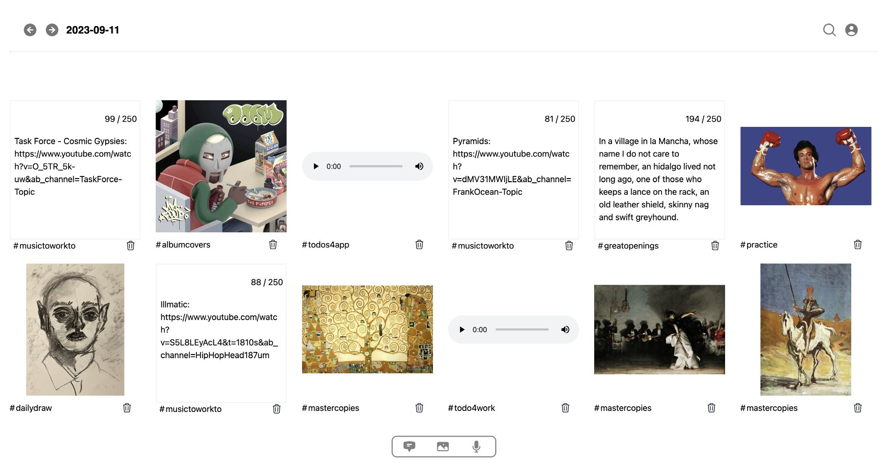
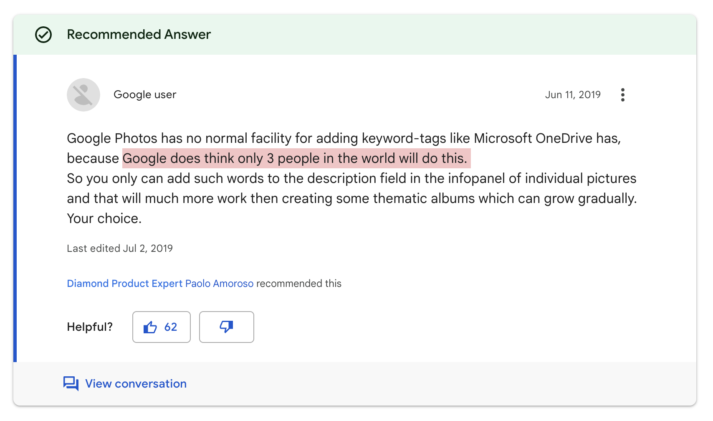
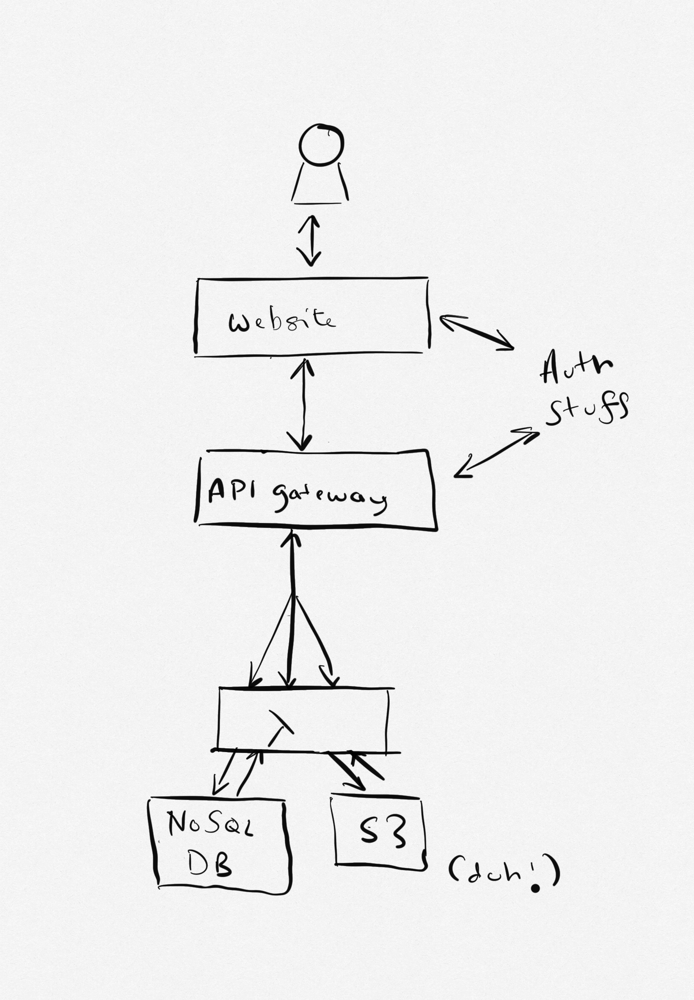

I used to be a Google FireBase kind of guy when it came to writing apps on my own time. I guess I got fond memories of focussing on what I was building because of the simplicity of the platform. I didn't have to worry about a lot of nonsense and I could just get to work.

However, I went all in on AWS because I figured "Hey, I use this a lot at work, I should probably get good at it". 

Meet: www.breadcrumb.live

Originally, I built this app to help me sample different media from ambient noises, to images to random thoughts. A scrapbook of sorts that I could look back on and see what I was thinking about at the time.

But mostly because Google Photos doesn't let you organize images by Tags

So to the 3 people who wanted it, here it is!

# Breadcrumb is simple but effective 

Nothing fancy but it's quite nice that the frontend and the backend are decoupled. The backend is a simple API Gateway and Lambda function that stores the data in DynamoDB and S3. 

The frontend is a simple React app that talks to the backend which is stored in an S3 bucket (managed by Amplify.)

Sign ups are done using Cognito and the whole thing is distributed by CloudFront.

# A lot of things, but very quick 

I was surprised at how quickly I was able to get this up and running. Most importantly, I am able to see this and see where I can extend it as well. I really like how things have panned out. So much so that I am working on releasing the code as open source in the form of a boiler plate.

UPDATE: the front end boilerplate is done: https://github.com/bhurghundii/aws-vite-react-boilerplate

